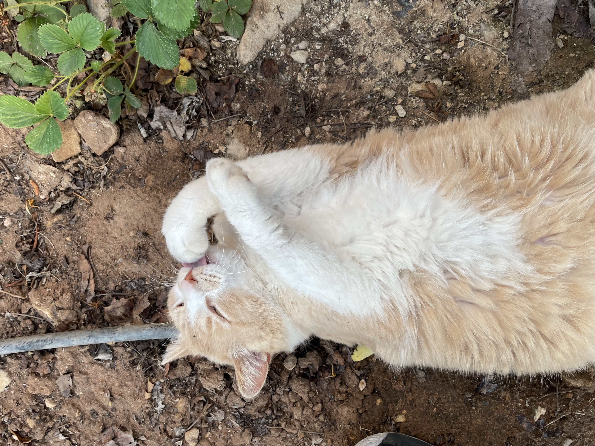
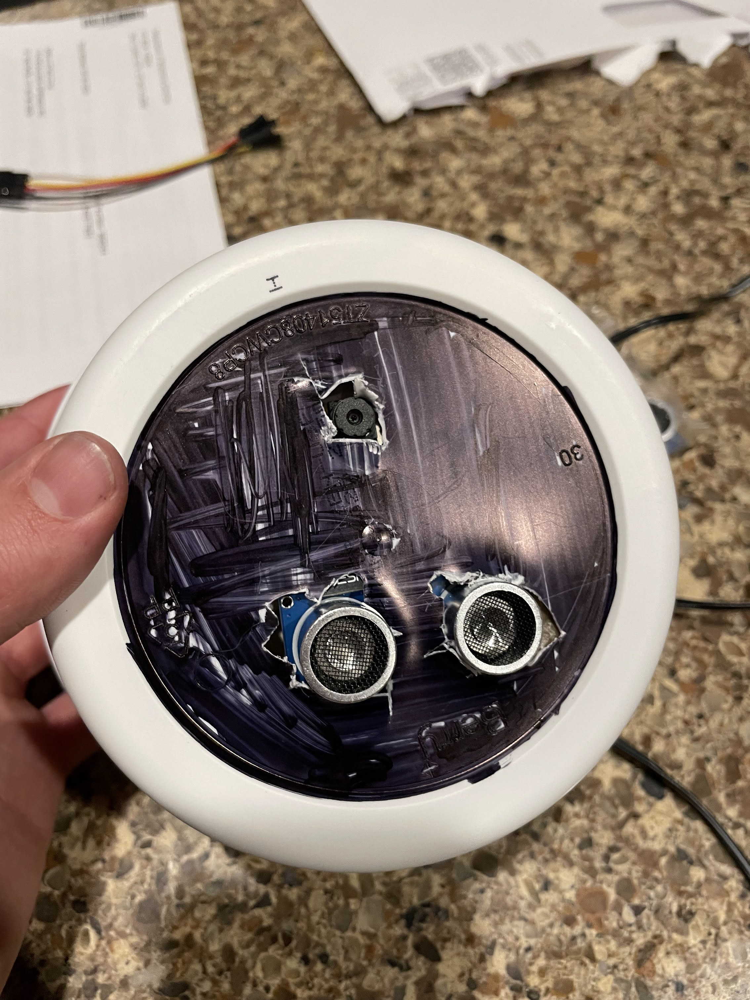

# KippyCam
Kippy is an outdoor cat, but in order to monitor his movements and help him get his food I created this app.

### Hardware Components:
 - ESP32-CAM microcontroller 
 - a power supply 
 - 9V AC adapter plug 
 - HC-SR04 Ultrasonic Sensor for motion detection 
 - a small breadboard 
 - dupont wires
 - disposable tupperware container

### Stack
- Arduino 
- React Native
- Firebase 

### Processes
Kippy walks by the sensor -> That tiggers taking a photo. Sends photo to Firebase -> Read photo and display on app.

## Photos

